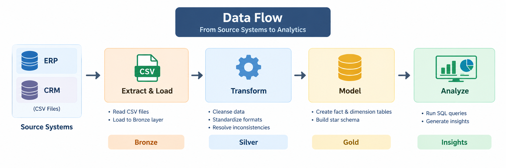
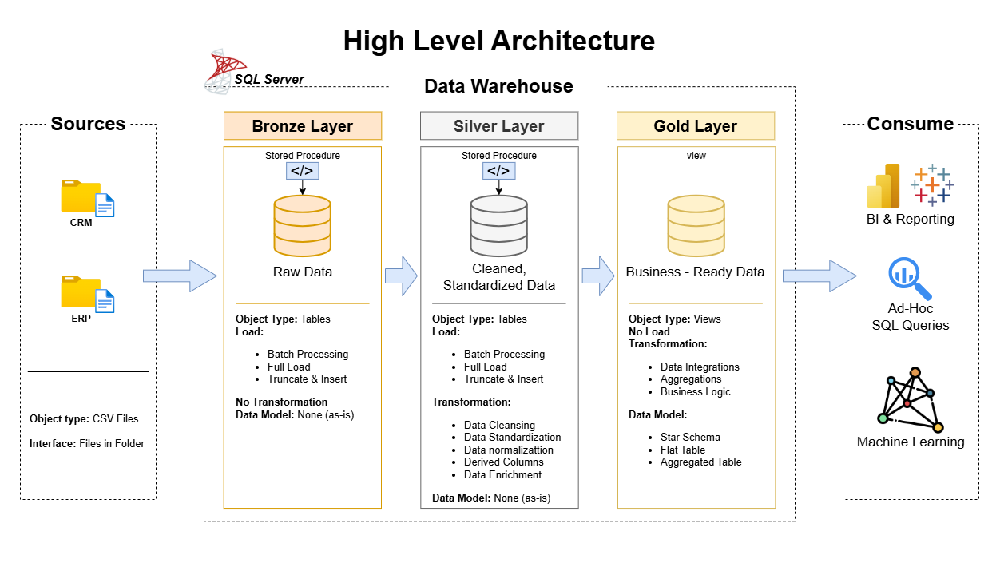

# sql-data-warehouse-project
Building a modern data warehouse with SQL server, including ETL processes, data modelling, and analytics.

Welcome to my **Data Warehouse and Analytics Project**.

This project is a hands-on implementation of a modern data warehouse using **SQL Server**. It covers the complete data warehousing process, starting with raw data from ERP and CRM systems and transforming it into a clean, structured, and analytics-ready data model.

The main purpose of this project is to apply SQL and data warehousing concepts in a practical, end-to-end project while gaining experience with **ETL, data cleansing, data integration, dimensional modeling, and analytical SQL**.

---

## Project Overview

The goal of this project is to build a modern data warehouse that consolidates data from multiple source systems and prepares it for analytical reporting.

The project follows a layered **Medallion Architecture** consisting of three main layers:

- **Bronze Layer** – Stores the raw data loaded directly from the source systems.
- **Silver Layer** – Cleans, transforms, standardizes, and integrates the raw data.
- **Gold Layer** – Contains business-ready data organized into a star schema for analytical queries and reporting.

The complete workflow can be summarized as:

**Source Systems → Bronze → Silver → Gold → Analytics**

## Data Flow

The data flows through the warehouse in a series of stages, from the source systems to the final analytical layer:



---

## Data Architecture

The data warehouse follows a three layered architecture to separate raw data ingestion, data transformation, and business-level analytics.



### Bronze Layer

The Bronze layer is the raw data storage layer.

Data from the ERP and CRM source systems is imported from CSV files into SQL Server with minimal transformation.

The main purpose of this layer is to:

- Preserve the original source data
- Provide a reliable landing area for incoming data
- Separate raw data from transformation processes
- Maintain a clear starting point for the ETL pipeline

### Silver Layer

The Silver layer is responsible for preparing the raw data for analytical use.

Data is cleaned, standardized, and transformed to resolve issues found in the source systems.

The transformation process includes:

- Data cleansing
- Handling missing and invalid values
- Standardizing data formats
- Correcting data inconsistencies
- Data type transformations
- Data integration
- Applying required business rules

### Gold Layer

The Gold layer contains the final business-ready data.

The transformed data is organized into a **star schema** consisting of fact and dimension tables.

This layer is designed specifically for analytical queries, reporting, and business insights.

---

## Project Objectives

The main objectives of this project are:

1. Build a modern data warehouse using SQL Server.
2. Import data from ERP and CRM source systems.
3. Design a Bronze, Silver, and Gold data architecture.
4. Develop ETL processes for loading and transforming data.
5. Identify and resolve data quality issues.
6. Integrate data from multiple source systems.
7. Build a dimensional data model using a star schema.
8. Create SQL-based analytical queries.
9. Document the data warehouse architecture and data model.
10. Apply SQL and data engineering concepts in a practical project.

---

## Data Sources

The project uses data from two source systems:

### ERP

The ERP system provides operational business data such as customer, product, and sales-related information.

### CRM

The CRM system provides customer and other related business information used to complement the ERP data.

The source data is provided in **CSV format** and is initially loaded into the Bronze layer before being cleaned and transformed through the subsequent layers.

---

## ETL Pipeline

The data pipeline consists of three major stages.

### 1. Extract & Load

Raw CSV files are extracted from the source datasets and loaded into the Bronze layer.

**CSV Files → Bronze Tables**

At this stage, the objective is to preserve the source data rather than perform extensive transformations.

### 2. Transform

The raw Bronze data is processed in the Silver layer.

**Bronze Tables → Silver Tables**

This stage focuses on:

- Cleaning the data
- Standardizing values
- Correcting inconsistencies
- Handling invalid records
- Converting data types
- Applying business rules

### 3. Load & Model

The processed Silver data is transformed into the final Gold-layer model.

**Silver Tables → Gold Tables**

The Gold layer provides the structure required for analytical queries and reporting.

---

## Data Modeling

The Gold layer uses a **star schema** to organize the data for analytical workloads.

The model consists primarily of:

### Fact Tables

Fact tables contain measurable business events and transactional information that can be analyzed.

### Dimension Tables

Dimension tables contain descriptive information that provides context for analyzing the facts.

This structure makes it easier to perform analytical queries such as:

- Sales analysis
- Customer analysis
- Product analysis
- Trend analysis

The star schema allows analytical queries to efficiently combine measurable facts with descriptive dimensions.

The data model is documented in:

```text
docs/data_models.drawio
```

---

## Analytics & Reporting

Once the Gold layer is created, the warehouse can be used to perform SQL-based analysis, to answer business questions and generate analytical insights.

The main analytical areas covered by the project are:

- **Customer Behavior**
- **Product Performance**
- **Sales Trends**

The analytical layer is designed to help transform raw operational data into meaningful information that can support business decision-making.

---

## Data Quality

Data quality is an important part of the data warehouse process.

Before the data reaches the Gold layer, the source data is examined and transformed to address issues such as:

- Missing values
- Invalid values
- Duplicate or Inconsistent records
- Incorrect data types
- Formatting inconsistencies
- Data integration issues between source systems

Validation and testing scripts are maintained separately in the `tests/` directory.

---

## Technologies Used

| Technology                              | Purpose                                                  |
| --------------------------------------- | -------------------------------------------------------- |
| **SQL Server**                          | Database and data warehouse                              |
| **SQL**                                 | Data extraction, transformation, loading, and analysis   |
| **SQL Server Management Studio (SSMS)** | Database development and management                      |
| **Draw.io**                             | Architecture, ETL, data flow, and data modeling diagrams |
| **Git**                                 | Version control                                          |
| **GitHub**                              | Project repository and source control                    |
| **CSV**                                 | Source data format                                       |

---

## Repository Structure

```text
data-warehouse-project/
│
├── datasets/
│   └── ...                              # ERP and CRM source CSV files
│
├── docs/
│   ├── etl.drawio                      # ETL process diagram
│   ├── data_architecture.drawio        # Data warehouse architecture
│   ├── data_architecture.png           # Architecture diagram
│   ├── data_catalog.md                 # Dataset and column documentation
│   ├── data_flow.drawio                # Data flow diagram
│   ├── data_models.drawio              # Star schema / data model
│   ├── naming-conventions.md           # Naming conventions
│   └── requirements.md                 # Project requirements
│
├── scripts/
│   ├── bronze/                         # Raw data ingestion scripts
│   ├── silver/                         # Data cleansing and transformation
│   └── gold/                           # Business-ready data model
│
├── tests/                              # Data quality and validation scripts
│
├── README.md                           # Project documentation
├── LICENSE                             # License information
├── .gitignore                          # Git ignored files
└── requirements.txt                    # Project requirements
```

---

## Documentation

Additional project documentation is available in the `docs/` directory.

It includes:

- Data Architecture
- ETL Design
- Data Flow
- Data Model
- Data Catalog
- Naming Conventions
- Project Requirements

These documents provide a detailed view of how the warehouse is structured and how data moves through the different layers.

---

## Project Scope

This project focuses on working with the **latest available dataset** rather than maintaining historical versions of changing records.

Historical data tracking and historization are not part of the current implementation.

The primary focus is on:

- Data ingestion
- Data cleansing
- Data transformation
- Data integration
- Data modeling
- Data quality
- Analytical SQL querying

---

## Key Skills Demonstrated

Through this project, I practiced and applied concepts in:

### SQL

- Complex SQL queries
- Joins
- Aggregations
- Subqueries
- Common Table Expressions
- Window functions
- Data transformation
- Data validation

### Data Warehousing

- Data warehouse architecture
- Medallion Architecture
- ETL pipelines
- Fact and dimension tables
- Star schema
- Dimensional modeling

### Data Engineering

- Data ingestion
- Data cleansing
- Data transformation
- Data integration
- Data quality checks
- Source-to-target data flow

### Data Analytics

- Analytical SQL queries
- Customer analysis
- Product analysis
- Sales analysis
- Business-oriented metrics or reporting

---

## Future Improvements

Some possible improvements for future versions of this project include:

- Implementing incremental data loading
- Adding historical data tracking
- Automating the ETL process
- Adding scheduled data refreshes
- Building a BI dashboard on top of the Gold layer
- Adding more automated data quality tests
- Implementing pipeline monitoring and logging
- Extending the warehouse with additional business domains

---

## How to Run the Project

### Prerequisites

Before running the project, install:

1. **SQL Server**
2. **SQL Server Management Studio (SSMS)**
3. **Git** (optional, for cloning the repository)

### Setup

1. Clone this repository.
2. Open the SQL scripts using SQL Server Management Studio.
3. Configure the SQL Server database according to the project scripts.
4. Load the source CSV files from the `datasets/` directory.
5. Execute the Bronze-layer scripts to ingest the raw data.
6. Execute the Silver-layer scripts to clean and transform the data.
7. Execute the Gold-layer scripts to create the analytical model.
8. Run the validation scripts in the `tests/` directory.
9. Execute the analytical queries against the Gold layer.

---

## Learning Reference

This project was developed as part of my learning journey through the SQL and Data Warehouse material provided by **Data with Baraa**.

The project follows the concepts, architecture, requirements, and learning approach taught in the course. The implementation in this repository represents my own hands-on practice and understanding of those concepts.

**Course & Project Reference:**

- Data with Baraa — SQL Ultimate Course
- Data with Baraa — SQL Data Warehouse Project

I would like to credit **Data with Baraa** for providing the educational material and project framework that I used to learn and build this project.

---

## License

This project is intended primarily for **educational and portfolio purposes**.

Please refer to the original course and project materials from **Data with Baraa** for their respective licensing and usage terms.

---

## About This Project

This repository represents my hands-on practice in **SQL, data warehousing, ETL, data modeling, and data analytics**.

Rather than focusing only on writing individual SQL queries, this project demonstrates how SQL can be used as part of a complete data pipeline — starting with raw operational data and ending with a structured analytical data warehouse.
